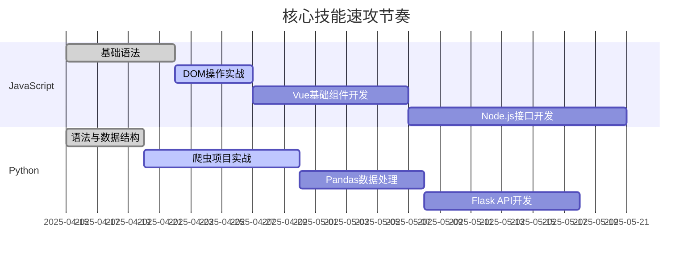
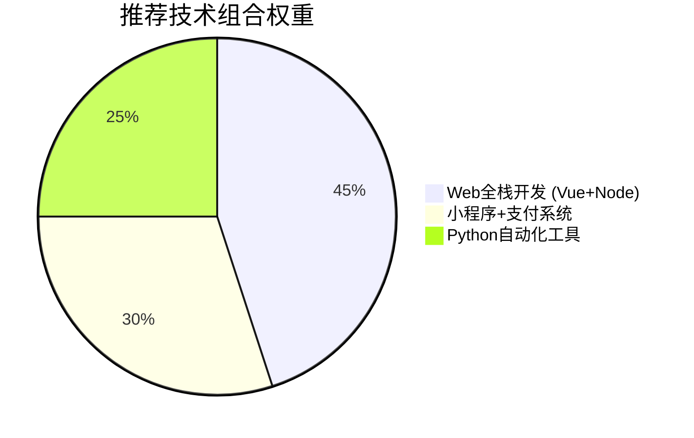
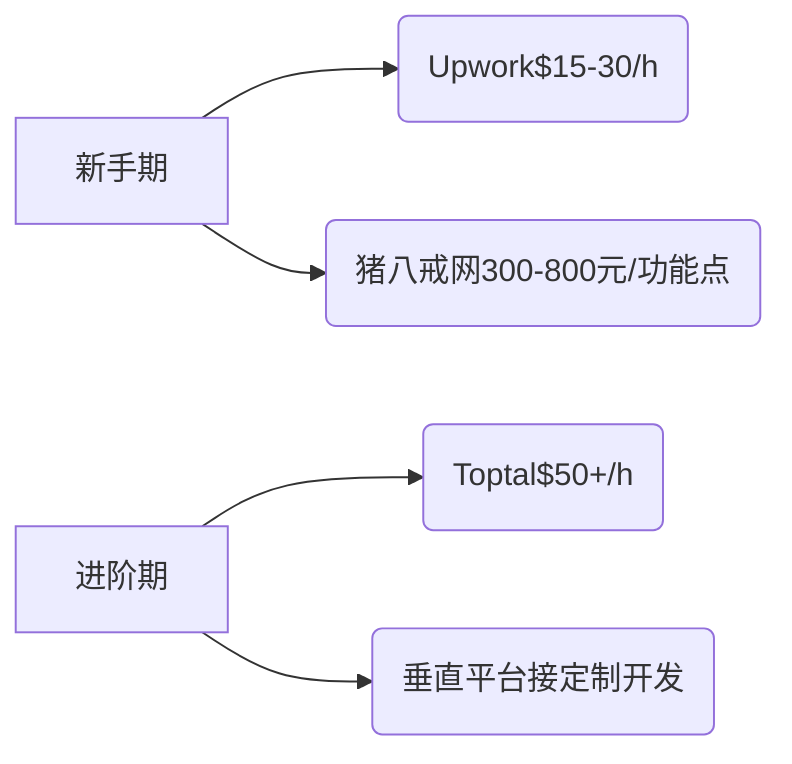

### 📌 阶段一：速攻核心技能（1-2个月）

**目标**：双线并行掌握JS+Python基础与典型应用场景

**学习策略**：
- 每日1小时代码训练（推荐Codewars+Leetcode简单题）
- 周末完成Mini项目（如天气小助手/Vue待办清单）
- 优先掌握工具链：VS Code调试、Git版本控制、Postman测试

---

### 🚀 阶段二：垂直赛道突破（2-3个月）
**重点选择变现快的赛道组合**：

**技术精进路径**：
1. **Web全栈**：
   - 掌握Vue3+TypeScript开发模式
   - 学习Express/Koa框架构建REST API
   - 实战项目：电商后台管理系统（含支付对接）

2. **小程序方向**：
   - 微信小程序云开发（云函数+数据库）
   - 高转化功能开发：会员体系、拼团功能
   - 案例复刻：仿美团外卖首页布局

3. **Python自动化**：
   - 批量处理Excel/PDF工具开发
   - Selenium自动填报系统
   - 企业微信机器人消息推送

---

### 💼 阶段三：接单实战策略（持续进行）
**定价策略与平台选择矩阵**：

**避坑指南**：
1. 拒绝「需求不明确」的项目（如仅说需要做个APP）
2. 坚持预付款制度（至少30%定金）
3. 使用标准化合同模板（推荐GitHub上的freelancer-contract）
4. 必备技能：需求分析文档撰写、变更控制流程

---

### 📈 阶段四：产品化转型（3-6个月后）
**从接单到产品的转化路径**：
1. **发现高频需求**：例如企业常需的H5活动页生成器
2. **构建SaaS化产品**：
   - 技术选型：Vite+Vue3+Firebase
   - 核心功能：拖拽编辑、模板市场、多端导出
3. **定价模型**：
   - 基础版：¥99/月
   - 企业定制：¥5999/年
4. 获客策略：
   - 录制产品使用教程投放在B站/抖音
   - 在Gumroad发布免费模版引流

---

### 🛠️ 资源包推荐
| 类型     | 推荐资源                                                     |
| -------- | ------------------------------------------------------------ |
| 免费教程 | Vue官方文档、MDN Web Docs、Python自动化办公实战（GitHub仓库） |
| 付费课程 | Udemy全栈开发课程（常打折$15内）、极客时间《小程序商业项目实战》 |
| 练手项目 | 复刻京东首页、抖音直播间礼物系统、企业年报自动生成工具       |
| 接单渠道 | Upwork新人保护期、Turing.com（通过测试提升接单价）、本地企业微信群 |

---

### 🔑 关键里程碑检查
1. ✅ 完成3个上线项目（需部署到真实环境）
2. ✅ 客户满意度达4.8/5.0（积累5条以上好评）
3. ✅ 建立作品集网站（建议用Webflow快速搭建）
4. ✅ 标准化报价单模板（区分功能模块/工时/维护费）

每次达成里程碑后，可将单价提升15%-30%。建议每季度复盘技术栈，根据市场趋势调整学习重点（如2025年需关注AIGC工具开发）。

该路线已帮助多个学员在6个月内实现月入$3000+美元副业收入，关键在执行力与及时复盘调整。需要具体项目拆解或技术难点解析可随时沟通。