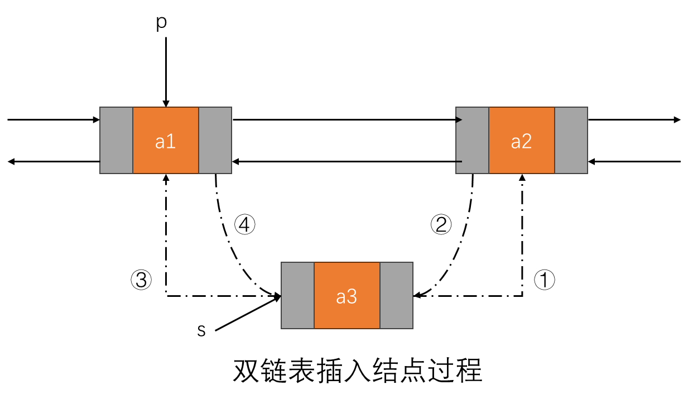
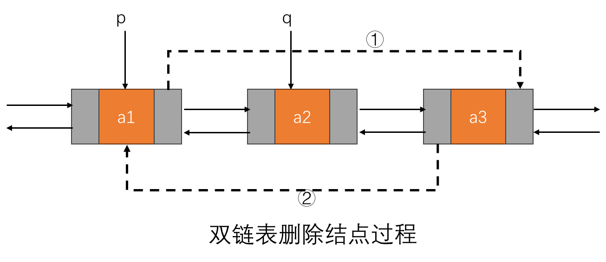

<center style="font-family: 华文新魏"><font size="12px" color="#4870ac">王道408 数据结构</font></center>

[toc]

# 第2章 线性表

## 2.3 线性表的链式表示

### 2.3.1 单链表的基本概念

线性表的`链式存储结构`，也称为单链表，是指通过一组任意的存储单元来存储线性表中的数据元素的数据结构。为了维护数据元素之间的线性关系，每个链表结点不仅包含元素自身的信息，还包含一个指向其后继结点的指针。（即，`各结点间的先后关系通过指针来表示`）

单链表结点的结构如下图所示：

- `data（数据域）`：用于存放数据元素的值。
- `next（指针域）`：用于存放后继结点的地址。

这种结构使得单链表可以`动态地分配内存`，不需要事先确定数据元素的数量，并且在插入和删除操作时，能够灵活地调整数据元素的存储位置。


#### 2.3.1.1 单链表的优缺点

- **优点**
  1. **动态内存分配**：单链表可以根据需要动态地分配和释放内存，无需预先分配固定大小的存储空间，从而节省内存。

  2. **插入和删除操作高效**：插入和删除操作只需修改相关结点的指针，不涉及大量数据元素的移动，因此在任意位置进行插入和删除操作的时间复杂度为 `O(1)`。

  3. **更高的灵活性**：可以方便地调整链表的大小，适应不同数量的数据元素。


- **缺点**
  1. **访问速度较慢**：由于单链表的元素不是连续存储的，访问某个特定位置的元素需要从头结点开始逐一遍历，时间复杂度为 `O(n)`，不如数组的随机访问效率高。

  2. **额外的存储空间**：每个结点除了存储数据元素外，还需要存储一个指针，这些指针域占用了额外的存储空间。

  3. **不易实现逆向遍历**：单链表只能`从前向后遍历`，逆向遍历较为困难，需要额外的数据结构（如双链表）或额外的存储来记录遍历路径。

  4. **增加编程复杂性**：与数组相比，单链表的实现和操作相对复杂，尤其是在处理指针和内存管理时，需要更加小心。


总的来说，单链表适用于需要频繁插入和删除操作的应用场景，但在需要快速随机访问元素的情况下，效率不如数组。

#### 2.3.1.2 带头结点的单链表 V.S. 不带头结点的单链表

带头结点的单链表和不带头结点的单链表之间有一些关键的区别，主要体现在结构和操作上：

**带头结点的单链表**

1. **定义**：
   - 包含一个额外的`头结点`, 不直接存储数据，主要用于简化链表操作。

2. **优点**：
   - **简化操作**：插入和删除操作在链表的`头部`时不需要特殊处理。
   - **统一处理**：链表的所有操作（如查找、插入、删除）都可以统一处理，不需判断链表是否`为空`。

3. **缺点**：
   - **内存开销**：额外的`头结点`增加了内存消耗。

**不带头结点的单链表**

1. **定义**：
   - 第一个结点直接存储`数据`, 没有`头结点`。

2. **优点**：
   - **内存节省**：不需要额外的`头结点`, 节省内存。

3. **缺点**：
   - **特殊处理**：在链表`为空`或在头部进行插入和删除时需要特别处理，代码可能更复杂。

**总结**

选择使用`带头结点`或`不带头结点`的单链表，主要取决于具体应用场景和需求。如果希望简化操作并统一处理，`带头结点`的链表更为适合；如果内存限制较为严格且链表操作相对简单，则`不带头结点`的链表可能更优。

#### 2.3.1.3 头结点和头指针的区分

在单链表数据结构中，头结点（head node）和头指针（head pointer）是两个容易混淆但又各自不同的重要概念。让我们详细解释它们的定义和容易混淆的点。

**头结点（Head Node）**

头结点是指`链表中的第一个结点`，通常存储链表中的第一个元素的数据。在链表结构中，头结点本身就是一个结点，包含`数据域和指向下一个结点的指针（即next指针）`。

**头指针（Head Pointer）**

头指针是一个`指针变量`，它指向链表的第一个结点（即头结点）。头指针本身不存储链表的数据，它只是一个指针，用于`存储头结点的地址，以便能够访问链表`。

总结：不管带不带头结点，头指针始终指向链表的`第一个结点`，而头结点是带头结点链表中的第一个结点，结点内通常`不存储信息`。

#### 2.3.1.4 链表的扩展

链表是一种灵活的数据结构，具有许多扩展和变体，适用于不同的应用场景。

`双向链表`的每个结点有两个指针，分别指向`前一个结点`和`后一个结点`，可以更方便地在两端进行插入和删除操作，支持`从后向前`遍历。

`循环链表`的最后一个结点的指针指向链表的`头结点`, 形成一个闭环，处理某些需要持续遍历的场景时可以避免`空指针异常`。

`静态链表`使用数组模拟链表结构，通过下标进行链接，在内存管理上更简单，不需要动态分配内存，适用于`结点数固定`的场合。

链表的扩展形式丰富多样，选择合适的链表类型可以提高`算法效率`和`实现的灵活性`，适应不同的数据处理需求。

### 2.3.2 单链表结点的代码描述(以C语言为例)

```c
// 设置别名
typedef int Elemtype;
// 定义单链表结点结构体
typedef struct LNode {
    Elemtype data;         // 数据部分，可以根据实际需要定义不同类型的数据
    struct LNode *next;  // 指针部分，指向下一个结点的地址
} LNode, *LinkList;
```

在这个结构体中，`data` 是存储结点数据的变量，`next` 是一个指向 `struct LNode` 类型的指针，它指向链表中的下一个结点。通过这种方式，每个结点就能够存储自己的数据，并且通过 `next` 指针链接到下一个结点，从而形成一个链表。

#### 2.3.2.1 typedef关键字的用法

`typedef` 是C语言中的一个关键字，用于`为已有数据类型定义新的别名`。它的主要作用是增强代码的可读性和易用性，特别是在处理复杂的数据结构时，如结构体或者函数指针等。

**单链表结点定义时，为什么要使用 `typedef`？**

- 在单链表结点的定义中，使用 `typedef` 的主要原因有两点：

  - **简化类型名称**：定义单链表结点结构体时，结构体名 `struct LNode` 和指向该结构体的指针 `struct LNode *` 是比较冗长的。使用 `typedef` 可以为 `struct LNode` 定义一个更简洁的别名 `LNode`，使得代码更加清晰和简洁。
  - **抽象数据类型**：通过 `typedef`，可以将数据类型的实现与其名称分离开来。这样一来，如果需要修改数据类型或者在多个文件中使用相同的数据类型时，只需修改一处 `typedef` 定义即可，提高了代码的维护性和可重用性。


**`typedef` 的语法**

- `typedef` 的语法格式如下：

  ```c
  typedef existing_type new_type_name;
  ```

  - `existing_type` 是已有的数据类型，可以是基本数据类型（如 `int`, `float` 等），也可以是自定义的结构体、枚举类型等。
  - `new_type_name` 是为 `existing_type` 定义的新的别名。

#### 2.3.2.2 `LNode` VS `LinkList`

在这段代码中，`LNode`和`*LinkList`有不同的含义和用途：

1. `LNode`：
   - 这是一个`结构体类型`，表示`单链表中的一个结点`。定义了结点的`data（数据部分）`和`next（指向下一个结点的指针）`。

2. `LinkList`：
   - 这是一个指向`LNode`类型的`指针类型`。它代表了`一个指向链表的指针`，可以用来`方便地操作链表`，比如创建、插入、删除等。

**总结**

`LNode`是结点的具体类型，而`*LinkList`是一个指向该类型的指针，通常用来表示整个链表的头指针。

#### 2.3.2.3 带头结点的单链表V.S.不带头结点的单链表

带头结点的单链表和不带头结点的单链表的区别如下：

- 带头结点的单链表：

  - 头结点不存储数据，仅作为入口。

  - 插入、删除操作较简洁，不需要特殊处理头部。

  - 需要额外内存存储头结点。

  - 适合频繁操作链表头部。

- 不带头结点的单链表：

  - 第一个节点即头节点，直接存储数据。

  - 插入、删除头部节点时需要额外判断。

  - 无需额外内存开销。

  - 适合操作简单、内存紧张的场景。

### 2.3.3 带头结点的单链表的实现（以C语言为例）

#### 2.3.3.1 单链表的结构定义

单链表的结构体通常包含`一个数据域`和`一个指向下一个结点的指针`。每个结点的结构体通常如下定义：

```c
// ============================预处理信息============================
typedef int bool;      // C语言没有bool类型，使用int模拟，0为false，非0为true
#define true 1         // 定义true为1
#define false 0        // 定义false为0
typedef int ElemType;  // 定义链表数据类型为int

// ============================单链表结点结构定义============================
typedef struct LNode {
    ElemType data;      // 数据
    struct LNode *next; // 指向下一个结点
} LNode, *LinkList;     // LNode为结点类型，LinkList为结点指针类型
```

**解释**：

- C语言本身没有`bool` 类型，因此用 `typedef int bool;` 定义，同时定义`0` 表示 `false`，非零值（如 `1`）表示 `true`，以此模拟布尔类型。
- `ElemType` 用于指定链表的数据类型，默认为 `int`，可以根据需要修改。
- `LNode` 结构体表示链表结点，包含数据域 `data` 和指针 `next`，用于链接下一个结点。
- `LinkList` 是指向链表头结点的指针类型，便于操作链表。

#### 2.3.3.2 初始化单链表

- 函数名称：`bool initList(LinkList *L)`

- 函数功能：初始化一个带头结点的单链表。

- 函数思路：  
  1. 在堆上分配内存生成头结点。  
  1. 判断`内存分配是否成功`，若失败则返回`false`。  
  1. 头结点的`next`指针指向`NULL`。  
  1. 初始化成功则返回`true`。


- 注意事项：  
  1. 参数L为`指向链表的指针`，其本质是一个`二级指针`，即`LNode **L`。
  2. 在堆上分配内存的操作有可能失败，所以需要`判断是否分配成功`。
  3. 头结点本身不存储数据，但遵循`定义变量即初始化`的原则，将头结点的`data域`初始化为0。
- 使用二级指针的原因
  - `L`是一个`指向指针的指针`，对`L`的操作会`改变L指向的地址的内容`。
  - `*L`是指`向链表的头指针`，即`头结点的地址`，对`*L`的操作会`改变头结点的内容`。
  - 因此，可以使用二级指针在函数内部改变`*L`的内容，从而改变`外部指针L指向的地址的内容`。
  - 如果参数是`LinkList L`（即`LNode *L`），即直接传递指针，那么只能改变`指针的内容`，无法改变`指针指向的地址的内容`。

```c
/**
 * @brief 初始化带头结点的单链表
 * @param LinkList *L 指向链表头指针的指针
 * @return bool 成功返回true，失败返回false
 */
bool initList(LinkList *L)
{
    printf("[INFO] initList()函数被调用...\n");
    *L = (LinkList)malloc(sizeof(LNode)); // 生成头结点
    if(NULL == *L)
    {
        printf("[ERROR] 初始化链表失败！ErrorText: 在堆上分配内存失败！\n");
        return false;
    }
    printf("[INFO] 初始化链表成功！\n");
    (*L)->data = 0; // 头结点不存储数据,但初始化为0
    (*L)->next = NULL;
    return true;
}
```

#### 2.3.3.3 销毁单链表

- 函数名称：`bool destroyList(LinkList *L)`
- 函数功能：销毁一个带头结点的单链表。
- 函数思路：  
  1. 判断链表指针是否`有效`（即`L和*L是否为NULL`），如果无效则`返回false`。
  2. 创建`两个临时指针p和q`，`p`指向`头结点`，`q`用于`释放结点`。
  3. `循环遍历链表`，释放每个结点的内存空间。
  4. 释放完所有结点后，将头指针`置为NULL`。
  5. 销毁成功`返回true`。
- 注意：
  1. 销毁链表时，需要`释放每个结点的内存空间`，否则会造成`内存泄漏`。
  1. 代码中释放结点内存的过程是`将首元素从链表中断开`，`原位于首元素之后的元素`成为新的首元素，然后释放`原首元素的内存`，如此循环。
  1. 销毁链表后，需要`将头结点的内存空间也释放掉`，同时`将头指针置为NULL`，否则在链表最终被销毁后，会导致`有一块分配到堆区的内存空间没有被释放`，造成`内存泄漏`。
  1. 销毁算法的时间复杂度为`O(n)`，其中n为`链表的长度`，空间复杂度为`O(1)`。
  1. 关于函数参数的说明，详见`initList()函数`的说明，简而言之，`initList()函数`和`destoryList()函数`都需要`对指向链表的指针进行操作`，所以参数必须是`指向“指向链表的指针”的指针`，而其他函数如`printList()`、`insertList()`等只需要对链表进行访问或操作，所以参数只需要是`指向链表的指针`即可。

```C
/**
 * @brief 销毁链表
 *      销毁一个带头结点的单链表
 * @param LinkList *L
 *      指向链表的指针
 * @return bool
 *      true: 销毁成功
 *      false: 销毁失败
 */
bool destroyList(LinkList *L)
{
    printf("[INFO] destroyList()函数被调用...\n");
    if(NULL == L || NULL == *L)
    {
        printf("[ERROR] 销毁链表失败！ErrorText: 链表不存在！\n");
        return false;
    }
    LinkList p = *L;    // 创建临时指针p指向头结点
    LinkList q = NULL;  // 创建临时指针q
    while(p->next != NULL) // 循环遍历链表
    {
        q = p->next;        // q指向第一个元素
        p->next = q->next;  // 断链操作，将首元素从链表中断开，头结点p指向第二个元素
        free(q);            // 释放原首元素q的内存空间
    }
    free(*L); // 释放头结点的内存空间
    *L = NULL;
    printf("[INFO] 销毁链表成功！\n");
    return true;
}
```

#### 2.3.3.4 打印链表

- 函数名称：`bool printList(const LinkList L)`

- 函数功能：本函数用于`打印一个带头结点的单链表`。
- 函数思路：
  1. 判断链表是否`有效`，即`L是否为NULL`，如果无效则`返回false`。
  2. 创建`临时指针p`指向`链表中的第一个元素`。
  3. `循环遍历链表`，打印每个元素的值。
  4. 打印成功`返回true`。
- 注意：
  1. 打印链表前，需要判断`链表是否存在`，否则有可能会导致`空指针异常`。
  2. 打印链表的时间复杂度为`O(n)`，其中n为`链表的长度`，空间复杂度为`O(1)`。
  3. 函数参数`const LinkList L`表示传递的是一个`常量指针`，使用`LinkList`而不是`LNode *L`是为了`增加代码的可读性`，且传递指针可`节省内存空间`，而用`const`修饰表示`不允许修改指针指向的内容`，这样可以`避免误操作`。

```c
/**
 * @brief 打印链表
 *      打印一个带头结点的单链表
 * @param const LinkList L
 *      链表
 * @return bool
 *      true: 打印成功
 *      false: 打印失败
 */
bool printList(const LinkList L)
{
    printf("[INFO] printList()函数被调用...\n");
    if(NULL == L)
    {
        printf("[ERROR] 打印链表失败！ErrorText: 链表不存在！\n");
        return false;
    }
    LinkList p = L->next; // 创建临时指针p指向链表中的第一个元素
    printf("[INFO] 链表元素：[HNode]-->"); // 打印头结点
    while(p != NULL)
    {
        printf("[%d]-->", p->data);
        p = p->next;
    }
    printf("[NULL]\n");
    return true;
}
```

#### 2.3.3.5 判空操作

- 函数名称：`bool isEmpty(const LinkList L)`
- 函数功能：本函数用于`判断一个带头结点的单链表是否为空`。
- 函数思路：
  1. 首先判断`链表是否有效`，即`L是否为NULL`，如果`无效`则返回`true`。
  2. 再判断`链表的第一个元素是否为NULL`，如果是则返回true，否则返回false。
- 注意：
   1. 判断链表是否为空时，需要先判断链表是否存在，否则会导致`空指针异常`。
   2. 判断链表是否为空的时间复杂度为`O(1)`，空间复杂度为`O(1)`。
   3. 函数参数const LinkList L的说明详见printList()函数的说明。

```cpp
/**
 * @brief 判断链表是否为空
 *      判断一个带头结点的单链表是否为空
 * @param const LinkList L
 *      链表
 * @return bool
 *      true: 链表为空
 *      false: 链表不为空 
 */
bool isEmpty(const LinkList L)
{
    printf("[INFO] isEmpty()函数被调用...\n");
    if(NULL == L || NULL == L->next)
    {
        printf("[INFO] 链表不存在或为空！\n");
        return true;
    }
    else
    {
        printf("[INFO] 链表不为空！\n");
        return false;
    }
}
```

#### 2.3.3.6 求长度操作

- 函数名称：`int length(const LinkList L)`
-  函数功能：本函数用于`求一个带头结点的单链表的长度`。
- 函数思路
   1. 判断`链表是否存在`，如果`不存在`则返回`-1`。
   2. 创建一个`变量len`用于存储`链表的长度`，初始化为`0`。
   3. 创建一个`临时指针p`指向链表中的`第一个元素`。
   4. 循环遍历链表，每遍历一个元素，`len加1`。
   5. 遍历完链表后，返回`len`。
- 注意
   1. 求链表长度时，需要先判断链表是否存在，否则会导致空指针异常。
   2. 求链表长度的时间复杂度为`O(n)`，其中n为`链表的长度`，空间复杂度为O(1)。
   3. 函数参数const LinkList L的说明详见printList()函数的说明。

```c
/**
 * @brief 求链表长度
 *      求一个带头结点的单链表的长度
 * @param const LinkList L
 *      链表
 * @return int
 *      链表的长度
 */
int length(const LinkList L)
{
    printf("[INFO] length()函数被调用...\n");
    if(NULL == L)
    {
        printf("[ERROR] 求链表长度失败！ErrorText: 链表不存在！\n");
        return -1;
    }
    int len = 0;
    LinkList p = L->next;
    while(NULL != p)
    {
        len++;
        p = p->next;
    }
    printf("[INFO] 链表长度为：%d\n", len);
    return len;
}
```

#### 2.3.3.7 创建新结点

- 函数名称：`LNode* createNewNode(ElemType e)`
- 函数功能：本函数用于`创建一个新结点`。
- 函数思路
  1. 在`堆上`分配内存生成`一个新结点`。
  2. 判断`生成新结点是否成功`，如果失败则返回`NULL`。
  3. 将新结点的`数据域`赋值为`e`，`指针域`赋值为`NULL`。
  4. 创建成功返回`新结点指针`。
- 注意
  1. 因为在堆上分配内存会有`失败`的可能，所以需要判断`是否分配成功`。
  2. 新结点的`next指针`最好初始化为`NULL`，这样符合`指针创建即初始化`的原则。

```c
/**
 * @brief createNewNode
 *      创建新结点
 * @param e
 *     结点数据
 * @return
 *    成功：返回新结点指针
 *    失败：返回NULL
 */
LNode* createNewNode(ElemType e)
{
    printf("[INFO] createNewNode()函数被调用...\n");
    LNode *node = (LNode *)malloc(sizeof(LNode));// 在堆上分配内存
    if(NULL == node)
    {
        printf("[ERROR] 创建新结点失败！ErrorText: 在堆上分配内存失败！\n");
        return NULL;
    }
    node->data = e;
    node->next = NULL;
    return node;
}
```

#### 2.3.3.8 在指定结点后插入结点

- 函数名称：`bool insertNextNode(LNode *p, ElemType e)`
- 函数功能：本函数用于`在指定结点后插入结点`。
- 函数思路
  1. 判断`指定结点是否存在`，如果不存在则返回`false`。
  2. 创建一个新结点，并`判断是否创建成功`，如果`创建失败`则返回`false`。
  3. 将`新结点的next指针`指向`指定结点的后继节点`。
  4. 将`指定结点的next指针`指向`新结点`。
  5. 插入成功返回`true`。
- 注意
  1. 参数p为`LNode *`类型，即指向结点的指针，表示`指定结点`，此处使用指针的原因是为了`在函数内部改变指定结点的指针域的内容`。
  2. 插入新结点时，必须先`让指定结点的后继结点成为新结点的后继结点`(即`将指定结点的next域赋值给新结点的next域`)，然后再`让新结点成为指定结点的后继结点`(即`将新结点的地址赋值给指定结点的next域`)，二者顺序`不能颠倒`，否则会导致`链表断裂`。
  3. 插入结点的时间复杂度为`O(1)`，空间复杂度为`O(1)`。

```c
/**
 * @brief insertNextNode
 *      在指定结点后插入结点
 * @param p
 *      指定结点
 * @param e
 *      结点数据
 * @return bool
 *      true: 插入成功
 *      false: 插入失败
 */
bool insertNextNode(LNode *p, ElemType e)
{
    printf("[INFO] insertNextNode()函数被调用...\n");
    if(NULL == p)
    {
        printf("[ERROR] 插入结点失败！ErrorText: 指定结点不存在！\n");
        return false;
    }
    LNode *newNode = createNewNode(e);
    if(NULL == newNode)
    {
        printf("[ERROR] 插入结点失败！ErrorText: 创建新结点失败！\n");
        return false;
    }
    // 插入结点，注意顺序不能颠倒
    newNode->next = p->next;
    p->next = newNode;
    printf("[INFO] 插入结点成功！\n");
    return true;
}
```

#### 2.3.3.9 在指定结点前插入结点

- 函数名称：`bool insertPriorNode(LNode *p, ElemType e)`
- 函数功能：本函数用于`在指定结点前插入结点`。
- 函数思路
  1. 判断`指定结点是否存在`，如果`不存在`则返回`false`。
  2. 创建一个新结点，并判断`是否创建成功`，如果`创建失败`则返回false。
  3. 先`以后插法插入新结点`，再`交换数据`。
  4. 插入成功返回`true`。
- 注意
  1. 常规的前插操作是`找到指定结点的前驱结点，然后在前驱结点后插入新结点`，此法时间复杂度为`O(n)`，不推荐使用。
  2. 本函数是`在指定结点后插入新结点`，然后`交换指定结点和新结点的数据`，时间复杂度为`O(1)`。

```c
/**
 * @brief insertPriorNode
 *      在指定结点前插入结点
 * @param p
 *      指定结点
 * @param e
 *      结点数据
 * @return bool
 *      true: 插入成功
 *      false: 插入失败
 */
bool insertPriorNode(LNode *p, ElemType e)
{
    printf("[INFO] insertPriorNode()函数被调用...\n");
    // 合法性检查
    if(NULL == p)
    {
        printf("[ERROR] 插入结点失败！ErrorText: 指定结点不存在！\n");
        return false;
    }
    // 创建新结点
    LNode *newNode = createNewNode(e);
    if(NULL == newNode)
    {
        printf("[ERROR] 插入结点失败！ErrorText: 创建新结点失败！\n");
        return false;
    }
    // 先以后插法插入新结点，再交换数据
    newNode->next = p->next;
    p->next = newNode;
    ElemType temp = p->data;// 临时变量temp用于交换
    p->data = newNode->data;
    newNode->data = temp;
    printf("[INFO] 插入结点成功！\n");
    return true;
}
```

#### 2.3.3.10 按位查找

- 函数名称：`LNode* getElem(LinkList L, int i)`
- 函数功能：本函数用于`按位序查找链表中的元素`。
- 函数思路
  1. 判断`链表是否存在`，如果`不存在`则返回`NULL`。
  2. 判断`位置i是否合法`，如果`不合法`则返回`NULL`。
  3. 特殊情况：获取`头结点`，即`i=0`时，`直接返回头指针`。
  4. 创建一个`临时指针p`指向链表中的`第一个元素`，创建一个`变量pos`用于记录`当前遍历的元素位序`。
  5. 循环遍历链表，直到找到第i个元素。
  6. 判断是否`找到第i个元素`，如果没有找到则返回`NULL`。
  7. 找到第i个元素后，返回`该结点的指针`。
- 注意
  1. 按位查找的时间复杂度为`O(n)`，其中n为`链表的长度`，空间复杂度为`O(1)`。
  2. 链表的位序从1开始。

```c
/**
 * @brief getElem
 *     按位查找
 * @param LinkList L
 *      链表
 * @param int i
 *      位置
 */
LNode* getElem(LinkList L, int i)
{
    printf("[INFO] getElem()函数被调用...\n");
    printf("[INFO] 尝试获取链表的第%d个元素...\n", i);
    // 合法性检查
    if(NULL == L)
    {
        printf("[ERROR] 获取结点失败！ErrorText: 链表不存在！\n");
        return NULL;
    }
    if(i < 0)
    {
        printf("[ERROR] 获取结点失败！ErrorText: 位置i非法（小于0）！\n");
        return NULL;
    }
    // 特殊情况：获取头结点
    if(0 == i)
    {
        printf("[INFO] 待查找位置为0，即头结点！\n");
        return L;
    }
    // 遍历链表，直到找到第i个元素
    LNode *p = L->next; // 创建临时指针p指向链表中的第一个元素
    int pos = 1;        // 创建变量pos用于记录当前遍历的元素位序
    while(NULL != p && pos < i) // 遍历链表
    {
        p = p->next;
        pos++;
    }
    // 判断是否找到第i个元素
    if(NULL == p)
    {
        printf("[ERROR] 获取结点失败！ErrorText: 未找到第%d个元素！\n", i);
        return NULL;
    }
    printf("[INFO] 获取结点成功！结点数据为：%d\n", p->data);
    return p;
}
```

#### 2.3.3.11 按值查找

- 函数名称：`LNode* locateElem(LinkList L,int *i, ElemType e)`
- 函数功能：本函数用于`按值查找链表中的元素`。
- 函数思路
  1. 首先进行`合法性检查`，判断`链表是否存在`，如果`不存在`则返回`NULL`。
  2. 创建一个`临时指针p`指向`链表中的第一个元素`，创建一个`变量pos`用于记录`当前遍历的元素位序`。
  3. 遍历链表，直到找到`数据域为e的`元素。
  4. 判断是否`找到数据域为e的元素`，如果没有找到则返回`NULL`。
  5. 找到`数据域为e的元素`后，返回`该结点的指针`。
- 注意
  1. 按值查找的时间复杂度为`O(n)`，其中n为`链表的长度`，空间复杂度为`O(1)`。

```c
/**
 * @brief locateElem
 *      按值查找
 * @param LinkList L
 *      链表
 * @param int *i
 *      位置
 * @param ElemType e
 *      结点数据
 * @return LNode*
 *      要查找的结点的指针，如果查找失败则返回NULL
 */
LNode* locateElem(LinkList L,int *i, ElemType e)
{
    printf("[INFO] locateElem()函数被调用...\n");
    printf("[INFO] 尝试查找链表中数据为%d的元素...\n", e);
    // 合法性检查
    if(NULL == L)
    {
        printf("[ERROR] 查找结点失败！ErrorText: 链表不存在！\n");
        return NULL;
    }
    // 创建临时指针p指向链表中的第一个元素
    LNode *p = L->next;
    int pos = 1; // 创建变量pos用于记录当前遍历的元素位序
    // 遍历链表，直到找到数据域为e的元素
    while(NULL != p && p->data != e)
    {
        p = p->next;
        pos++;
    }
    // 判断是否找到数据域为e的元素
    if(NULL == p)
    {
        printf("[ERROR] 查找结点失败！ErrorText: 未找到数据域为%d的元素！\n", e);
        return NULL;
    }
    *i = pos;
    printf("[INFO] 查找结点成功！结点位序为：%d\n", pos);
    return p;
}
```

#### 2.3.3.12 常用的插入操作（后插）

- 函数名称：`bool insertList(LinkList L, int i, ElemType e)`
- 函数功能：本函数是常用的`插入`操作，即`在指定位置i后插入结点`。
- 函数思路
  1. 首先进行`合法性检查`，判断`链表是否存在`，如果`不存在`则返回`false`。
  2. 判断`位置i是否合法`，如果`不合法`则返回`false`。
  3. 调用`getElem()`函数查找`第i-1个元素`，即`指定结点的前驱结点`，如果找不到则返回`false`。
  4. 调用`insertNextNode()`函数插入新结点。
- 注意
  1. 在指定结点之后插入新结点的时间复杂度为`O(1)`,但按位插入需要`遍历链表`，所以时间复杂度为`O(n)`，其中n为`链表的长度`。
  2. 插入操作不需要额外的内存空间，所以空间复杂度为`O(1)`。
  3. 插入算法允许`在表尾插入新元素`，但不允许在`超过链表长度+1`的位置插入新元素，否则会导致`链表断裂`。

```c
/**
 * @brief insertList
 *      常用的插入操作（后插）
 * @param L
 *      链表
 * @param i
 *      位置
 * @param e
 *      结点数据
 * @return bool
 *      true: 插入成功
 *      false: 插入失败
 */
bool insertList(LinkList L, int i, ElemType e)
{
    printf("[INFO] insertList()函数被调用...\n");
    printf("[INFO] 尝试在链表的第%d个位置插入数据%d...\n", i, e);
    // 合法性检查
    if(NULL == L)
    {
        printf("[ERROR] 插入结点失败！ErrorText: 链表不存在！\n");
        return false;
    }
    if(i < 1)
    {
        printf("[ERROR] 插入结点失败！ErrorText: 位置i非法（小于1）！\n");
        return false;
    }
    LNode *p = getElem(L, i - 1); // 获取第i-1个元素
    // 判断是否找到第i-1个元素
    if(NULL == p)
    {
        printf("[ERROR] 插入结点失败！ErrorText: 位置i非法（大于链表长度+2）！\n");
        return false;
    }
    // 调用insertNextNode()函数插入新结点
    return insertNextNode(p, e);
}
```

#### 2.3.3.13 前插操作

- 函数名称：`bool insertListByForward(LinkList L, int i, ElemType e)`
- 函数功能：本函数是常用的前插操作，即`在指定位置i以前插方式插入结点`。
- 函数思路
  1. 首先进行`合法性检查`，判断`链表是否存在`，如果`不存在`则返回`false`。
  2. 再判断`位置i是否合法`，如果`不合法`则返回`false`。
  3. 调用`getElem()`函数`查找第i个元素`，即`指定结点`，如果找不到则返回`false`。
  4. 调用`insertPriorNode()`函数插入新结点。
- 注意
  1. 在指定结点之前插入新结点的时间复杂度为`O(1)`,但按位插入需要`遍历链表`，所以时间复杂度为`O(n)`，其中n为`链表的长度`。
  2. 插入操作不需要额外的内存空间，所以空间复杂度为`O(1)`。
  3. 前插操作理论上不能实现`在表尾插入新元素`，因为定位第i位元素时，会定位到`NULL`，从而无法找到`第i-1位元素`。但是稍微修改一下逻辑，即`当第i-1位元素存在但第i位元素不存在`时，即`第i位为表尾`，此时调用`insertNextNode()`函数即可插入到表尾。

```c
/**
 * @brief insertListByForward
 *      常用的前插操作
 * @param L
 *      链表
 * @param i
 *      位置
 * @param e
 *      结点数据
 * @return bool
 *      true: 插入成功
 *      false: 插入失败
 */
bool insertListByForward(LinkList L, int i, ElemType e)
{
    printf("[INFO] insertListByForward()函数被调用...\n");
    printf("[INFO] 尝试在链表的第%d个位置前插入数据%d...\n", i, e);
    // 合法性检查
    if(NULL == L)
    {
        printf("[ERROR] 插入结点失败！ErrorText: 链表不存在！\n");
        return false;
    }
    if(i < 1)
    {
        printf("[ERROR] 插入结点失败！ErrorText: 位置i非法（小于1）！\n");
        return false;
    }

    // 查找第i-1个元素
    LNode *p = getElem(L, i - 1);
    if(NULL == p)
    {
        printf("[ERROR] 插入结点失败！ErrorText: 位置i非法（大于链表长度+2）！\n");
        return false;
    }

    // 如果第i-1个元素p存在但是p->next不存在，说明p是最后一个元素
    // 则第i位为表尾，此时调用insertNextNode()函数即可插入到表尾
    if(NULL == p->next)
    {
        return insertNextNode(p, e);
    }
    return insertPriorNode(p->next, e);
}
```

#### 2.3.3.14 删除结点操作

- 函数名称：`bool removeNode(LinkList L, int i, ElemType *e)`
- 函数功能：本函数用于`删除链表中的第i个结点`。
- 函数思路
  1. 首先进行`合法性检查`，判断`链表是否存在`，如果`不存在`则返回`false`。
  2. 再判断`位置i是否合法`，如果`不合法`则返回`false`。
  3. 调用`getElem()`函数`查找第i-1个元素`，即`指定结点的前驱结点`，如果`找不到`则返回`false`。
  4. 将`待删除结点的数据`保存到`*e`中，再将`其后继结点的地址`赋值给`前驱结点的next指针`。
  5. `释放待删除结点的内存空间`，删除成功返回true。
- 注意
  1. 删除结点时，需要`释放结点的内存空间`，否则会造成`内存泄漏`。
  2. 删除指定结点的时间复杂度为`O(n)`，其中n为`链表的长度`，空间复杂度为`O(1)`。

```c
/**
 * @brief removeNode
 *      删除结点
 * @param L
 *      链表
 * @param i
 *      位置
 * @param e
 *      结点数据
 * @return bool
 *      true: 删除成功
 *      false: 删除失败
 */
bool removeNode(LinkList L, int i, ElemType *e)
{
    printf("[INFO] removeNode()函数被调用...\n");
    printf("[INFO] 尝试删除链表的第%d个结点...\n", i);
    // 合法性检查
    if(NULL == L || NULL == e)
    {
        printf("[ERROR] 删除结点失败！ErrorText: 链表不存在或e不存在！\n");
        return false;
    }
    if(i < 1)
    {
        printf("[ERROR] 删除结点失败！ErrorText: 位置i非法（小于1）！\n");
        return false;
    }
    // 查找第i-1个元素
    LNode *p = getElem(L, i - 1);
    if(NULL == p || NULL == p->next)
    {
        printf("[ERROR] 删除结点失败！ErrorText: 位置i非法（大于链表长度）！\n");
        return false;
    }
    // 删除结点
    LNode *q = p->next;
    *e = q->data;
    p->next = q->next;
    free(q);
    printf("[INFO] 删除结点成功！\n");
    return true;
}
```

#### 2.3.3.15 修改结点数据操作

- 函数名称：`bool setNode(LinkList L, int i, ElemType e)`
- 函数功能：本函数用于`修改链表中的第i个结点的数据`。
- 函数思路
  1. 首先进行`合法性检查`，判断`链表是否存在`，如果`不存在`则返回`false`。
  2. 再判断`位置i是否合法`，如果`不合法`则返回`false`。
  3. 调用`getElem()`函数`查找第i个元素`，如果`找不到`则返回`false`。
  4. `修改结点数据`，修改成功返回true。
- 注意
  1. 修改结点数据的时间复杂度为`O(n)`，其中n为`链表的长度`，空间复杂度为`O(1)`。

```c
/**
 * @brief setNode
 *      修改结点数据
 * @param L
 *      链表
 * @param i
 *      位置
 * @param e
 *      结点数据
 * @return bool
 *      true: 修改成功
 *      false: 修改失败
 */
bool setNode(LinkList L, int i, ElemType e)
{
    printf("[INFO] setNode()函数被调用...\n");
    printf("[INFO] 尝试修改链表的第%d个结点的数据为%d...\n", i, e);
    // 合法性检查
    if(NULL == L)
    {
        printf("[ERROR] 修改结点失败！ErrorText: 链表不存在！\n");
        return false;
    }
    if(i < 1)
    {
        printf("[ERROR] 修改结点失败！ErrorText: 位置i非法（小于1）！\n");
        return false;
    }
    // 查找第i个元素
    LNode *p = getElem(L, i);
    if(NULL == p)
    {
        printf("[ERROR] 修改结点失败！ErrorText: 位置i非法（大于链表长度）！\n");
        return false;
    }
    // 修改结点数据
    p->data = e;
    printf("[INFO] 修改结点成功！\n");
    return true;
}
```

### 2.3.4 不带头结点的单链表的实现（以C++语言为例）

#### 2.3.4.1 单链表结点类模板

```cpp
/**
 * @class LNode
 * @brief 单链表结点类模板
 * @tparam T 数据类型
 * @code
 * LNode<int> *node = new LNode<int>(10);
 * LNode<int> *node = new LNode<int>();
 * @endcode
 */
template <class T>
class LNode
{
public:
    LNode() : data(0), next(NULL) {};
    LNode(T e) : data(e), next(NULL) {};
    ~LNode() {};
    T data;
    LNode *next;
};
```

这段代码定义了一个名为 **`LNode`** 的单链表节点类模板，用于表示单链表中的节点。模板参数 **`T`** 允许`存储任意类型的数据`。每个节点包含以下两个成员：

- **`data`**：类型为 **`T`**，表示`存储在节点中的数据`。
- **`next`**：`指向下一个节点的指针`，用于`连接单链表中的其他节点`。

此外，该类提供了以下构造函数和析构函数：

1. **默认构造函数**：将数据初始化为 **`0`**，指针 **`next`** 初始化为 **`NULL`**。
2. **带参构造函数**：接受一个类型为 **`T`** 的参数 **`e`**，用于初始化数据成员 **`data`**，指针 **`next`** 仍初始化为 **`NULL`**。
3. **析构函数**：默认析构函数，用于`清理对象`。

#### 2.3.4.2 单链表类模板

```cpp
/**
 * @class LinkList
 * @brief 单链表类模板
 * @tparam T 数据类型
 * @code
 * LinkList<int> *list = new LinkList<int>();
 * @endcode
 */
template <class T>
class LinkList
{
public:
    LinkList():m_head(nullptr), m_len(0) {};                // 构造函数，初始化头指针为空
    ~LinkList() {destroyList();};                       // 析构函数，销毁链表
   /*
   ...相关操作函数
   */
private:
    LNode<T> *m_head;     // 头指针
    int m_len;            // 链表长度（可选）
};

```

**`LinkList`** 是一个`单链表的类模板`，用于`动态管理链表节点`。模板参数 **`T`** 指定链表中存储的`数据类型`。

- 类的主要功能

  - **构造函数**：初始化链表，将头指针 **`m_head`** 置为`NULL`，长度 **`m_len`** 置为 `0`。

  - **析构函数**：销毁链表并释放内存，防止资源泄漏。

- 成员变量

  - **`m_head`**：指向链表头节点的指针。

  - **`m_len`**：记录链表中节点的数量。

该类设计简洁，适合动态存储和操作数据，后续可以根据需要扩展功能。

#### 2.3.4.3 初始化链表

- 函数名称：`template<class T> bool LinkList<T>::initList()`
- 函数功能：本函数用于`初始化一个不带头结点的单链表`。
- 函数步骤：
  1. 判断`链表是否已经初始化(即头指针是否为空)`，若`已经初始化`，则返回`false`；
  2. 因为是不带头结点的单链表，所以将头指针`直接置为空`即可；
  3. 链表长度置为`0`，初始化成功返回`true`。
- 注意：
  1. 不带头结点的单链表初始化比较简单，只需`将头指针置为空`即可，其时间复杂度为`O(1)`。

```cpp
/**
 * @brief LinkList::initList 初始化链表
 * @param 无
 * @return bool
 *      true: 初始化成功
 *      false: 初始化失败
 */
template<class T>
bool LinkList<T>::initList()
{
    cout << "【INFO】initList()函数被调用！" << endl;
    if(NULL != m_head)
    {
        cout << "【ERROR】链表已经初始化！" << endl;
        return false;
    }
    m_head = NULL;
    m_len = 0;
    cout << "【INFO】链表初始化成功！" << endl;
    return true;
}

```

#### 2.3.4.4 销毁链表

- 函数名称：`template<class T> bool LinkList<T>::destroyList()`
- 函数功能：本函数用于`销毁一个不带头结点的单链表`。
- 函数步骤：
  1. 创建`临时指针p指向头指针`、`临时指针q用于记录p的下一个结点`；
  2. `遍历链表，释放每个结点`；
  3. 将`头指针置为空`，`链表长度置为0`，销毁成功返回`true`。
- 注意：
  1. 因为该单链表类有成员变量`len`记录`链表长度`，所以销毁链表时，也可以通过`len`来判断`链表是否为空`。
  2. 不带头结点的单链表不需要判断`头指针是否为空`，因为`头指针为空`表示其指向的是一个`空表`。
  3. 销毁操作的时间复杂度为`O(n)`。

```cpp
/**
 * @brief LinkList::destroyList 销毁链表
 * @param 无
 * @return bool
 *      true: 销毁成功
 *      false: 销毁失败
 */
template<class T> 
bool LinkList<T>::destroyList()
{
    cout << "【INFO】destroyList()函数被调用！" << endl;
    LNode<T> *p = m_head;     // 临时指针p指向头指针
    LNode<T> *q = NULL;     // 临时指针q用于记录p的下一个结点
    while (NULL != p)       // 遍历链表，释放每个结点
    {
        q = p->next;
        delete p;
        p = q;
    }
    m_head = NULL;            // 将头指针置为空
    m_len = 0;                // 将链表长度置为0
    cout << "【INFO】链表销毁成功！" << endl;
    return true;
}


```

#### 2.3.4.5 打印链表

- 函数名称：`template<class T> bool LinkList<T>::printList()`
- 函数功能：本函数用于`打印一个不带头结点的单链表`。
- 函数步骤：
  1. 判断链表`是否为空`，若`为空`，则`无需打印`，返回`false`；
  2. `遍历链表`，打印每个结点的`数据`；
  3. 打印成功返回`true`。
- 注意：
  1. 打印操作的时间复杂度为`O(n)`。

```cpp
/**
 * @brief LinkList::printList 打印链表
 * @param 无
 * @return bool
 *      true: 打印成功
 *      false: 打印失败
 */
template<class T>
bool LinkList<T>::printList()
{
    cout << "【INFO】printList()函数被调用！" << endl;
    if (NULL == m_head)     // 判断链表是否为空表
    {
        cout << "【ERROR】链表为空，无需打印！" << endl;
        return false;
    }
    // 遍历链表，打印每个结点的数据
    LNode<T> *p = m_head;
    cout << "List: ";
    while (NULL != p)
    {
        cout << p->data << "-->";
        p = p->next;
    }
    cout << "NULL" << endl;
    return true;
}
```

#### 2.3.4.6 判空

- 函数名称：`template<class T> bool LinkList<T>::isEmpty()`
- 函数功能：本函数用于`判断一个不带头结点的单链表是否为空`。
- 函数步骤：
  1. 方法一：判断`头指针是否为空`，若`为空`，则链表为空；
  2. 方法二：判断`链表长度是否为0`，若`为0`，则链表为空。
- 注意：
  1. 判断链表是否为空的时间复杂度为`O(1)`。

```c
/**
 * @brief LinkList::isEmpty 判断链表是否为空
 * @param 无
 * @return bool
 *      true: 链表为空
 *      false: 链表不为空
 */
template<class T>
bool LinkList<T>::isEmpty()
{
    cout << "【INFO】isEmpty()函数被调用！" << endl;
    // 方法1：判断头指针是否为空
    return (NULL == m_head);
    // 方法2：判断链表长度是否为0
    return (0 == m_len);
}
```

#### 2.3.4.7 获取链表长度

- 函数名称：`template<class T> int LinkList<T>::length()`
- 函数功能：本函数用于`获取一个不带头结点的单链表的长度`。
- 函数步骤：
  *          判断`头指针是否为NULL`，若为`NULL`，则链表`为空`，返回`长度0`；
  *          创建`临时指针p`指向`首元素`，`计数器count`初始化为`1`；
  *          遍历链表，计数器count`自增`；
  *          返回`链表长度count`。
- 注意：
  *          获取链表长度的时间复杂度为`O(n)`。
  *          不带头结点的单链表，需要针对`边界条件`进行特殊处理，如`头指针为空`时，返回长度0。

```c
/**
 * @brief LinkList::length 获取链表长度
 * @param 无
 * @return int 链表长度
 */
template<class T>
int LinkList<T>::length()
{
    cout << "【INFO】length()函数被调用！" << endl;
    if (NULL == m_head)
    {
        cout << "【INFO】链表为空，返回长度0！" << endl;
        return 0;
    }
    LNode<T> *p = m_head;   // 临时指针p指向头指针
    int count = 1;          // 计数器,因为头指针指向的是首元素，所以初始化为1
    while (NULL != p)
    {
        p = p->next;
        count++;
    }
    cout << "【INFO】链表长度为：" << count << endl;
    return count;
}
```

#### 2.3.4.8 按位查找

- 函数名称：`template<class T> LNode<T> *LinkList<T>::getElem(int i)`
- 函数功能：本函数用于获取一个不带头结点的单链表中`指定位置的元素`。
- 函数步骤：
  *          判断`i值是否合法`，若`小于1`，则返回`NULL`；
  *          创建`临时指针p`指向`首元素`，计数器j初始化为`1`；
  *          遍历链表，直到找到`第i个元素`，返回该元素；
  *          若未找到第i个元素，返回`NULL`。
- 注意：
  *          获取指定位置的元素的时间复杂度为`O(n)`。
  *          本函数中，while循环隐含`链表为空`的情况，即`头指针为空`时，最终返回`NULL`。

```c
/**
 * @brief LinkList::getElem 获取指定位置的元素
 * @param i 指定位置
 * @return LNode<T>* 指定位置的元素
 */
template<class T>
LNode<T> *LinkList<T>::getElem(int i)
{
    cout << "【INFO】getElem()函数被调用！" << endl;
    // 合法性判断
    if (i < 1)
    {
        cout << "【ERROR】查找失败！Error: i值非法(小于1)" << endl;
        return NULL;
    }
    // 开始查找
    LNode<T> *p = m_head;
    int j = 1;      // 因为头指针指向的是首元素，所以初始化为1
    while (NULL != p && j < i)
    {
        p = p->next;
        j++;
    }
    if (NULL == p)
    {
        if(i == 1)
        {
            cout << "【ERROR】查找失败！Error: 当前链表为空" << endl;
        }
        else
        {
            cout << "【ERROR】查找失败！Error: i值非法(大于链表长度)" << endl;
        }
        return NULL;
    }
    return p;      // 返回第i个元素
}
```

### 2.3.5 双链表的相关概念

#### 2.3.5.1 双链表的基本概念

**单链表的局限**：

单链表只能从头结点到尾结点进行`单向遍历`，`不能反向遍历`。这导致在某些需要频繁访问前驱结点的操作中效率较低。此外，在单链表中插入或删除一个结点时，若需要访问前驱结点，也较为不便。

**双链表的定义**：

双链表是一种链表结构，其中每个结点包含三个部分：一个`存储数据的字段`，一个`指向前驱结点的指针`，以及一个`指向后继结点的指针`。通过这两个指针，可以实现`从任一结点向前和向后的双向遍历`。


**双链表 V.S. 单链表**：

双链表与单链表的主要区别在于`双链表的结点包含两个指针`，一个`指向前一个结点`，一个指向后一个结点。这使得双链表可以进行`双向遍历`，更加灵活。在`插入`和`删除`操作中，双链表也更为方便（时间复杂度仅为`O(1)`），因为`可以直接访问前驱结点`。然而，双链表比单链表占用更多的内存，因为每个结点需要额外存储一个指针（存储密度更低）。

#### 2.3.5.1 双链表结点的代码描述（以C语言为例）

在C语言中，双链表结点的结构体定义通常如下：

```c
// 定义双链表结点的结构体
typedef struct DNode {
    ElemType data;           		// 存储数据的字段
    struct DNode* prev; 		// 指向前一个结点的指针
    struct DNode* next; 		// 指向后一个结点的指针
} DNode, *DLinkList;
```

**代码描述**：

1. **定义结构体：** 使用 `typedef struct` 关键字定义一个名为 `DNode` 的结构体。（D指Double）
2. **数据字段：** 在结构体中包含一个 `ElemType` 类型的字段 `data`，用于存储结点的数据。
3. **前驱指针：** 包含一个指向 `DNode` 结构体类型的指针 `prev`，用于指向前一个结点。
4. **后继指针：** 包含一个指向 `DNode` 结构体类型的指针 `next`，用于指向后一个结点。
5. **类型定义：** 使用 `typedef` 关键字，将 `struct DNode` 重命名为 `DNode`，并将 `struct DNode*` 重命名为 `DLinkList`，方便在代码中使用。

通过这种定义方式，可以更简洁地使用 `DNode` 和 `DLinkList` 类型，而无需每次都写出完整的 `struct` 关键字。

### 2.3.6 双链表的实现

#### 2.3.6.1 双链表的插入操作

在双链表中p所指的结点之后插入结点*s,其指针的变化过程如下图所示。



插入操作的代码片段如下：

```cpp
s->next = p->next;		\\ ①
p->next->prior = s;		 \\ ②
s->prior = p;			\\ ③
p->next = s;		      \\ ④
```

上述代码的语句顺序`不是唯一`的，但也不是任意的，`①和②两步`必须在`④步`之前，否则`*p的后继结点的指针`就会丢掉，导致插入失败。

#### 2.3.6.2 双链表的删除操作



```c
p->next=q->next;	 \\①
q->next->prior=p;	   \\②
free(q);			    \\释放结点空间
```

### 2.3.7 循环链表的相关概念


循环链表是一种链表结构，其中链表的最后一个结点指向头结点，形成一个环状结构。循环链表的相关概念可以大方向上分为`循环单链表`和`循环双链表`，它们的区别主要在于结点之间的链接方式。

#### 2.3.7.1 循环单链表

- 定义
  - 循环单链表是一种链表结构，其中每个结点都包含一个数据域和指向下一个结点的指针。链表的最后一个结点的指针指向`链表的头结点`，形成一个闭环。也就是说，从`表中任意一个结点`出发，都可以`找到表中的其他任何结点`，从头结点找到尾结点的时间复杂度为`O(n)`，但从尾结点找到头结点的时间复杂度为`O(1)`。

- 特点

  - `单向链接`：每个结点只有一个指向下一个结点的指针。

  - `循环`：最后一个结点指向头结点，形成循环。

  - `没有尾结点指针`：没有单独的指向尾结点的指针，尾结点的指针指向头结点。

- 应用
  - `约瑟夫问题`：经典的环形结构问题，循环链表用于模拟这些情形。
  - `资源管理`：如处理任务队列，保证任务按顺序处理且循环进行。

#### 2.3.7.2 循环双链表

- 定义
  - 循环双链表是一种链表结构，每个结点包含数据域、指向下一个结点的指针和指向前一个结点的指针。链表的表尾结点的`后继指针`指向`头结点`，头结点的`前驱指针`指向`尾结点`，形成一个双向循环。

- 特点

  - `双向链接`：每个结点包含两个指针，一个指向下一个结点，一个指向前一个结点。

  - `循环`：头结点的前驱指针指向尾结点，尾结点的后继指针指向头结点。

  - `尾结点与头结点相连`：在循环链表中，头结点与尾结点有相互连接的指针。

- 应用

  - `双向队列`：双向链表的特性适合实现双向队列（Deque）。

  - `内存管理`：如操作系统中的进程调度和内存分配。

#### 2.3.7.3 循环链表的优缺点

- 优点

  - `不浪费空间`：链表是动态的，可以有效利用内存空间。

  - `环形特性`：适用于需要循环或重复访问数据的应用场景。

  - `灵活的插入和删除操作`：插入和删除操作无需移动其他元素，只需要修改指针即可。

- 缺点

  - `复杂的指针管理`：需要小心管理指针，避免产生死循环。

  - `遍历较为麻烦`：相较于普通链表，循环链表的遍历需要特殊处理，避免陷入死循环。

总结来说，`循环单链表`和`循环双链表`都具有循环结构，区别在于结点是否具有双向指针，循环单链表适用于简单的循环场景，而循环双链表适合需要双向遍历的场景。

### 2.3.8 循环链表的代码实现

#### 2.3.8.1 循环单链表

`注`：本节讨论的代码，都是带头结点的循环单链表。

增加头结点的优点如下： 

1. 循环单链表中`首结点的插入和删除操作`与其他结点一致，无需进行特殊处理。
2. 无论循环单链表是否为空都有`一个头结点`，因此统一了`空表和非空表`的处理过程。

- 初始化


可以通过传入一个初始值，创建一个包含一个头节点的循环单链表。此时，节点的 `next` 指针指向自己，形成一个环。

```c
// 初始化循环单链表，返回头结点
Node* InitList() {
    Node* head = (Node*)malloc(sizeof(Node));
    if (!head) exit(1); // 分配失败
    head->next = head;  // 自循环
    return head;
}
```

- 判空

判断循环单链表是否为空，可以通过`检查表头结点的指针是否指向自己`来进行判断:

```c
int IsEmpty(Node* head) {
    return head->next == head;
}
```

- 判断指定结点p是否为表头或表尾

表头判断：表头节点就是指向第一个节点的指针，直接比较节点 `p` 与 `head` 即可。

表尾判断：表尾节点是指向头节点的节点，因此如果 `p->next == head` ，则说明该节点是表尾。

```c
int IsHead(Node* head, Node* p) {
    return head == p;
}

int IsTail(Node* head, Node* p) {
    return p->next == head;
}
```

- 在表头插入节点
- 在表中某节点之后插入节点
- 在表尾插入节点

#### 2.3.8.2 循环双链表


# 第3章 栈、队列和数组

# 第4章 串

# 第5章 树和二叉树

# 第6章 图

# 第7章 查找

# 第8章 排序